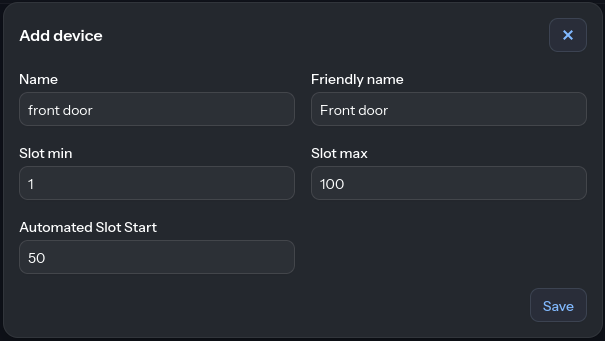
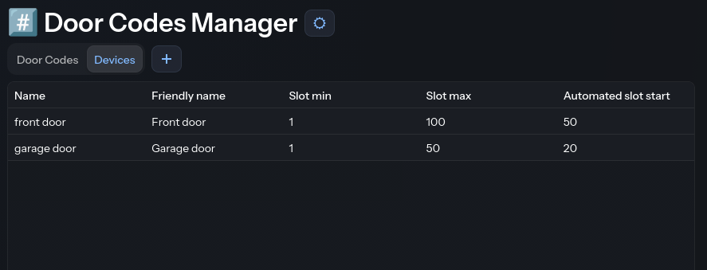
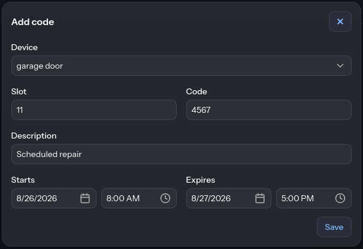
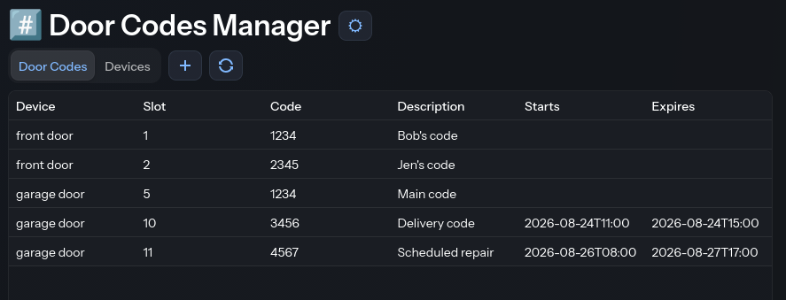

# door-codes-manager

Web app for managing door codes on a Zigbee2MQTT-connected smart lock. Add, remove, and automatically rotate codes; changes are pushed to the lock over MQTT and then saved to a SQLite database.

## How it works

Add a device, giving it the slot range the lock supports:



Automated slot start: this is the slot where automated codes start, if using that feature. It's a way to reserve some number of beginning slots for manual codes. If you don't want to use the automated codes, you can leave this blank.

Devices show up in their own tab, click a row to edit or delete a device:



Add a code to a slot on a device:



A door code can have a start date/time and an expiration date/time. On a timer (`code-start-and-expiration-check-timer` in config, default 5m), the app checks all codes: when a code's start time arrives it's pushed to the lock, and when a code's expiration time arrives it's removed from the lock and deleted. Codes without a start/expiration are permanent until manually deleted.

Codes show up in the main table, where you can click one to edit or delete it. The refresh button reconciles the database against what's actually programmed on a device, over a chosen slot range: it adds codes that exist on the lock but not the database, updates ones whose pin changed on the lock, and removes database entries for slots that are empty or disabled on the lock — useful for recovering state if the database and lock have drifted apart:



## Requirements

- A running Zigbee2MQTT instance with an MQTT broker
- A container runtime such as Docker or Podman (for the container path), or JDK 21 + the included Gradle wrapper for local runs

## Configuration

Copy the example config and fill in your values:

```sh
cp config/config.yaml.example config/config.yaml
```

```yaml
zigbee2Mqtt:
  mqtt:
    address: tcp://127.0.0.1   # your MQTT broker
    port: 1883
    topic: zigbee2mqtt         # Zigbee2MQTT base topic
    timeout: 15
    username: someuser
    password: somepassword
automation:                   # this section is optional, it can be deleted if not used
  mqtt:
    address: tcp://127.0.0.1  # your MQTT broker for automated codes, can be the same as your zigbee2Mqtt broker
    port: 1883
    topic: automated_door_codes
    username: someuser
    password: somepassword
security:
  rememberMeKey: change-me     # any random string, optional
  users:                       # only used if basicAuthEnabled is true
    - name: alice
      password: change-me      # plaintext here; hashed at startup
    - name: bob
      password: change-me
  basicAuthEnabled: true       # form login + HTTP basic auth using the users above
  oauth2Enabled: true          # OAuth2/OIDC login (e.g. Authelia), see below
  oauth2Group: door-codes-manager # OIDC group whose members get admin access
spring:                        # only needed if oauth2Enabled is true
  security:
    oauth2:
      client:
        provider:
          authelia:
            issuer-uri: https://your-oidc-provider
        registration:
          authelia:
            client-id: door-codes-manager
            client-secret: change-me
            scope: openid,groups
code-start-and-expiration-check-timer: 5m # scheduled timer to check start date and expiration date of door codes
```

`basicAuthEnabled` and `oauth2Enabled` can each be toggled independently. If both are `false`, the app requires no login at all and logs a `WARN` on startup (don't do this).

`config.yaml` is gitignored — never commit it.

## Running in a container

Pull the image from GHCR:

```sh
docker pull ghcr.io/allen-archer/door-codes-manager
```

Run it, mounting config, data, and logs directories:

```sh
docker run --rm -p 8080:8080 \
  -v "$(pwd)/data":/data \
  -v "$(pwd)/config":/config \
  -v "$(pwd)/logs":/logs \
  ghcr.io/allen-archer/door-codes-manager
```

The container reads config from `/config/config.yaml`, stores its SQLite
database in `/data`, and writes logs to `/logs`. Substitute `podman` (or
your runtime of choice) for `docker` if needed.

`scripts/build_image.sh` and `scripts/run_container.sh` show equivalent
build/run commands for local development.

## Running locally

```sh
./gradlew bootRun
```

Uses `./config/config.yaml` and `./data/door_codes_manager.db` relative to
the working directory by default (override with `CONFIG_PATH` / `DB_PATH`).

## Tests

```sh
scripts/run_tests.sh
```

## Tech stack

- Kotlin 2.3 / JDK 21
- Spring Boot 4.1, Spring Security
- Vaadin Flow 25.2
- Hibernate/JPA on SQLite
- Eclipse Paho MQTT client
- Gradle

## License

[GPL-3.0](LICENSE)